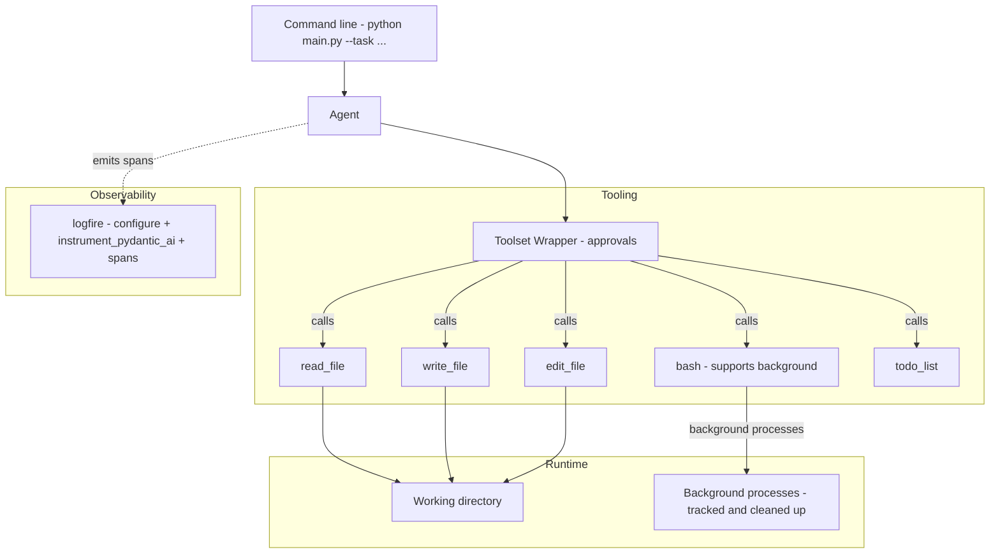

# Workshop Tutorial: Build a Full Stack Coding Agent with Pydantic AI

> This tutorial walks you step by step from a minimal agent to the fully featured code used in the workshop.
> Chapters: 0) Mermaid overview 1) Setup 2) Basic agent 3) User confirmation + background execution 4) Instrumentation 5) QA agent 6) Final code 7) Enhanced intelligence

---

## 0) Mermaid chart of the full agent



---

## 1) Setup

We will use uv for Python project management. You can run locally or in GitHub Codespaces.

### Option A - GitHub Codespaces (recommended)

We recommend Codespaces because the agent frequently calls bash commands, and Codespaces provides a fully configured Linux shell environment.

1. Create a new repo with this tutorial.
2. Open in Codespaces with Python 3.11 or newer.

### Option B - Local

- Python 3.11+ installed
- Git installed

### Initialize the project with uv

```bash
# Install uv if you do not have it
curl -LsSf https://astral.sh/uv/install.sh | sh

# Initialize a uv managed project
uv init

# Add dependencies
uv add pydantic-ai pydantic rich python-dotenv logfire
```

### Add a .env file

Create a `.env` file in the project root with the following variables:

```bash
LOGFIRE_TOKEN=""
ANTHROPIC_API_KEY=""
```

---

## 2) Basic agent

In this step we build the smallest useful agent with 5 tools: `read_file`, `write_file`, `edit_file`, `bash`, and `todo_list`. No user confirmations, no background execution in `bash`, and no Logfire.

Create a **single file** `main.py` in your project root with the code below:

```python
from __future__ import annotations

import argparse
import asyncio
import os
from dataclasses import dataclass, field
from pathlib import Path
from typing import Literal

import dotenv
from pydantic import BaseModel
from pydantic_ai import Agent, ModelRetry, RunContext
from rich import print

# Load .env if present
dotenv.load_dotenv()

# -------------------------
# Agent dependencies
# -------------------------
class Todo(BaseModel):
    title: str
    status: Literal["active", "in progress", "completed"]

@dataclass
class Deps:
    task: str
    cwd: Path
    todos: list[Todo] = field(default_factory=list)

# Utility helpers

def resolve_under_cwd(cwd: Path, rel: str) -> Path:
    base = cwd.resolve()
    p = (base / rel).resolve()
    if not str(p).startswith(str(base)):
        raise ValueError(f"Path escapes cwd: {rel}")
    return p

# -------------------------
# Tools
# -------------------------

def read_file(ctx: RunContext[Deps], path: str) -> str:
    """Read a UTF-8 text file under cwd and return its content.

    Args:
        path: The path to the file to read.
    """
    try:
        p = resolve_under_cwd(ctx.deps.cwd, path)
        return p.read_text(encoding="utf-8")
    except Exception as e:
        raise ModelRetry(f"Failed to read file '{path}': {e}")


def write_file(ctx: RunContext[Deps], path: str, content: str) -> dict:
    """Create or overwrite a UTF-8 text file under cwd with the given content.
    This tool requires user approval.
    Returns a summary with bytes written.

    Args:
        path: The path to the file to write.
        content: The content to write to the file.
    """
    try:
        p = resolve_under_cwd(ctx.deps.cwd, path)
        p.parent.mkdir(parents=True, exist_ok=True)
        b = content.encode("utf-8")
        p.write_bytes(b)
        return {"path": str(p), "bytes": len(b), "action": "wrote"}
    except Exception as e:
        raise ModelRetry(f"Failed to write file '{path}': {e}")


def edit_file(ctx: RunContext[Deps], path: str, old_string: str, new_string: str) -> dict:
    """Edit a file by replacing the first exact occurrence of old_string with new_string.
    The match must be exact including new lines and indentation.
    Returns a summary with replacements count.

    Args:
        path: The path to the file to edit.
        old_string: The string to replace. Must be exact including new lines and indentation.
        new_string: The string to replace with.
    """
    try:
        p = resolve_under_cwd(ctx.deps.cwd, path)
        data = p.read_text(encoding="utf-8")
        if old_string not in data:
            raise ModelRetry(f"String not found in file '{path}': {old_string[:50]}...")
        p.write_text(data.replace(old_string, new_string, 1), encoding="utf-8")
        return {"path": str(p), "replacements": 1}
    except ModelRetry:
        raise
    except Exception as e:
        raise ModelRetry(f"Failed to edit file '{path}': {e}")


def bash(ctx: RunContext[Deps], cmd: str, timeout: int = 60) -> dict:
    """Run a bash command in cwd and return exit_code, stdout, stderr.
    This tool requires user approval.
    When running commands that might require interactivity (like npm init), make sure to pass proper arguments to the command to prevent it from hanging. For example, npm init --yes will run the command without any interactivity.

    Use proper timeouts. If a command is expected to take a long time, use a longer timeout.

    Args:
        cmd: The bash command to run.
        timeout: The timeout in seconds for the command to run. Defaults to 60 seconds.
    """
    import subprocess
    try:
        proc = subprocess.run(
            cmd,
            cwd=str(ctx.deps.cwd),
            capture_output=True,
            text=True,
            timeout=timeout,
            check=False,
            shell=True,
        )
        return {"exit_code": proc.returncode, "stdout": proc.stdout, "stderr": proc.stderr}
    except subprocess.TimeoutExpired:
        raise ModelRetry(f"Command timed out after {timeout} seconds: {cmd}")
    except Exception as e:
        raise ModelRetry(f"Failed to execute command '{cmd}': {e}")


def todo_list(todos: list[Todo]) -> list[Todo]:
    """Set or update the current plan as a list of todos and return it back.
    Status is one of: active, in progress, completed. Use this tool for complex tasks to plan out the steps, and update your progress as you go.

    Args:
        todos: The list of todos to set or update.
    """
    return todos

# -------------------------
# Agent
# -------------------------
CODING_AGENT_INSTRUCTIONS = """
You are a senior full stack engineer who writes correct and minimal code.
Always start by listing files with `ls -la`, then plan with the todo_list tool, then execute.
Use Next.js, Tailwind, Prisma, and SQLite unless told otherwise.
Use grep and find to explore the repo when helpful.
"""

MODEL = os.getenv("MODEL", "claude-sonnet-4-0")

agent = Agent(
    MODEL,
    deps_type=Deps,
    tools=[read_file, write_file, edit_file, bash, todo_list],
    instructions=CODING_AGENT_INSTRUCTIONS,
    retries=30,
)

async def agent_loop(task: str, cwd: Path) -> str:
    deps = Deps(task=task, cwd=cwd)
    result = await agent.run(task, deps=deps)
    return result.output

# -------------------------
# CLI
# -------------------------

def parse_args(argv: list[str]) -> argparse.Namespace:
    p = argparse.ArgumentParser(description="Basic coding agent")
    p.add_argument("--task", required=True)
    return p.parse_args(argv)

if __name__ == "__main__":
    args = parse_args([] if False else __import__("sys").argv[1:])
    out = asyncio.run(agent_loop(task=args.task, cwd=Path.cwd()))
    print("
=== Agent Output ===
")
    print(out)
```

**Try it**

```bash
# Create a clean working directory so the agent does not edit this repo files (reset if exists)
rm -rf temp && mkdir temp && cd temp

# Run the agent pointing to the parent main.py
uv run ../main.py --task "Create a todo app. Should be a list of todos, with a textbox on top to add todos. Just type and enter to add. And an option to delete a todo or mark it as complete"
```

Notes

- No user confirmation yet
- `bash` has no background parameter
- No Logfire instrumentation

---

## 3) Add user confirmation and background execution

Now we wrap our tools so that risky ones require explicit approval, and enhance `bash` with a `background=True` option while tracking processes for cleanup.

### 3.1 Add imports and extend `Deps`

```python
import atexit
import os
import signal
import subprocess
from typing import Any
from pydantic_ai.toolsets import FunctionToolset, ToolsetTool, WrapperToolset

@dataclass
class Deps:
    task: str
    cwd: Path
    todos: list[Todo] = field(default_factory=list)
    background_processes: list[subprocess.Popen] = field(default_factory=list)
```

### 3.2 Enhance `bash` to support background

```python
def bash(ctx: RunContext[Deps], cmd: str, timeout: int = 60, background: bool = False) -> dict:
    """Run a bash command in cwd and return exit_code, stdout, stderr.
    This tool requires user approval.
    When running commands that might require interactivity (like npm init), make sure to pass proper arguments to the command to prevent it from hanging. For example, npm init --yes will run the command without any interactivity.

    Use proper timeouts. If a command is expected to take a long time, use a longer timeout.

    Args:
        cmd: The bash command to run.
        timeout: The timeout in seconds for the command to run. Defaults to 60 seconds.
        background: If True, run the command in the background and return immediately. The process will be killed when the script exits.
    """
    try:
        if background:
            # Start process in background without shell wrapper
            proc = subprocess.Popen(
                ["bash", "-c", cmd],
                cwd=str(ctx.deps.cwd),
                stdin=subprocess.DEVNULL,
                stdout=subprocess.DEVNULL,
                stderr=subprocess.DEVNULL,
                text=True,
                shell=False,
                start_new_session=True,  # Create new process group for safety
            )
            ctx.deps.background_processes.append(proc)
            return {"pid": proc.pid, "status": "running_in_background"}
        else:
            proc = subprocess.run(
                cmd,
                cwd=str(ctx.deps.cwd),
                capture_output=True,
                text=True,
                timeout=timeout,
                check=False,
                shell=True,
            )
            return {"exit_code": proc.returncode, "stdout": proc.stdout, "stderr": proc.stderr}
    except subprocess.TimeoutExpired:
        raise ModelRetry(f"Command timed out after {timeout} seconds: {cmd}")
    except Exception as e:
        raise ModelRetry(f"Failed to execute command '{cmd}': {e}")
```

### 3.3 Add `ApprovalToolset` wrapper

````python
def format_content_preview(content: str, max_lines: int = 10) -> str:
    """Format content for nice display, truncating if too long."""
    lines = content.split("\n")
    if len(lines) <= max_lines:
        return content

    preview_lines = lines[: max_lines // 2]
    preview_lines.append(f"... ({len(lines) - max_lines} more lines) ...")
    preview_lines.extend(lines[-max_lines // 2 :])
    return "\n".join(preview_lines)

class ApprovalToolset(WrapperToolset[Deps]):
    """A toolset wrapper that asks for approval for certain tools."""

    def __init__(self, wrapped: FunctionToolset[Deps]):
        super().__init__(wrapped)
        self.require_approval = {"bash", "write_file", "edit_file"}

    def _print_tool_start(self, name: str, tool_args: dict[str, Any]):
        """Print formatted tool execution start."""
        print(f"🔧 [bold blue]Tool Call[/]: [bold]{name}[/]")
        print(f"📝 [dim]Args:[/] {tool_args}")

    def _get_user_approval(self, name: str, tool_args: dict[str, Any]) -> bool:
        """Ask user for approval to execute a tool."""
        print("\n⚠️  [yellow]Approval Required[/]")
        print(f"🔧 Tool: [bold]{name}[/]")

        # Format args nicely for different tool types
        if name == "write_file":
            path = tool_args.get("path", "")
            content = tool_args.get("content", "")
            print(f"📁 Path: [cyan]{path}[/]")
            print(f"📝 Content ({len(content.split())} lines):")
            print(f"[dim]```[/]\n{format_content_preview(content)}\n[dim]```[/]")
        elif name == "edit_file":
            path = tool_args.get("path", "")
            old_string = tool_args.get("old_string", "")
            new_string = tool_args.get("new_string", "")
            print(f"📁 Path: [cyan]{path}[/]")
            print("🔍 Find:")
            print(
                f"[dim]```[/]\n[red]{format_content_preview(old_string, 5)}[/red]\n[dim]```[/]"
            )
            print("🔄 Replace with:")
            print(
                f"[dim]```[/]\n[green]{format_content_preview(new_string, 5)}[/green]\n[dim]```[/]"
            )
        else:
            print(f"📝 Args: {tool_args}")

        while True:
            response = (
                input(
                    "\n🤔 Approve execution? (Y)es/(n)o/(s)kip for this tool/(sa)skip all approvals:"
                )
                .lower()
                .strip()
            )
            if response in ["y", "yes", ""]:
                return True
            elif response in ["n", "no"]:
                return False
            elif response in ["s", "skip", "skip for this tool"]:
                self.require_approval.remove(name)
                return True
            elif response in [
                "sa",
                "skip all approvals",
                "skip all approvals for all tools",
            ]:
                self.require_approval = set()
                return True
            else:
                print("❓ Please enter 'y' or 'n'")

    def _get_new_instructions(self) -> str:
        """Get new instructions from user when they decline approval."""
        print("\n📋 [yellow]Please provide new instructions:[/]")
        new_instructions = input("💭 Instructions: ").strip()
        return new_instructions

    async def call_tool(
        self, name: str, tool_args: dict[str, Any], ctx: RunContext, tool: ToolsetTool
    ) -> Any:
        """Override tool execution with approval logic."""
        # Print formatted start
        self._print_tool_start(name, tool_args)

        # Check if approval is needed
        if name in self.require_approval:
            approved = self._get_user_approval(name, tool_args)
            if not approved:
                new_instructions = self._get_new_instructions()
                error_msg = f"Tool execution declined by user. New instructions: {new_instructions}"
                return error_msg

        result = await super().call_tool(name, tool_args, ctx, tool)
        return result
````

### 3.4 Enhanced instructions and wrap the tools

```python
# Enhanced instructions with background execution guidance
CODING_AGENT_INSTRUCTIONS = """You are a senior full stack engineer who writes correct, minimal, and well structured code.
You can design and implement end to end apps. Always produce a concrete plan first using the todo_list tool.
Prefer iterative edits: read files before editing, summarize what will change, then edit.

Your code repository is a fullstack app that suppose to work fully end to end.

Use the tools provided to you to complete the task. Be diligent but keep code simple.

# Workflow:
1. Always start your task by running ls -la to see the files in the current directory.
2. Read existing relevant files to get a sense of the codebase.
3. Plan your task by using the todo_list tool.
4. Execute on your todos and iterate.

# Guidelines
1. Unless explicitly instructed otherwise, use NPM,Nextjs and Tailwindcss, Prisma and SQLite.
2. If working of an empty project, use NextJS CLI to initialize the project. Make sure to pass --yes both after npx and after the NextJS CLI command to skip the interactive. e.g. npx --yes create-next-app@latest myapp --yes
2. Use Bash tools (ls, grep, find, etc.) to explore the codebase if necessary.
3. Keep things simple and clean.
4. Use `find` to locate files by name or extension.
5. Use `grep` to search file contents if you know a function or keyword but not the file.
6. When relevant, always build the project when you are done to make sure it works.
7. When done, start development servers in the background to test functionality. Use the background=True parameter in the bash tool to run servers without blocking. Explicitly define a random port for the server to avoid conflicts. For example `bash("PORT=3041 npm run dev", background=True)`

In your final response, explain your user facing implementation you have done (no need to mention code or any technical details) and the endpoint (eg localhost:3000) to test the app.
"""

# Wrap the 5 tools with approvals
wrapped = FunctionToolset([read_file, write_file, edit_file, bash, todo_list])
approval_toolset = ApprovalToolset(wrapped)

# Rebuild the agent to use the wrapper and enhanced instructions
agent = Agent(
    MODEL,
    deps_type=Deps,
    toolsets=[approval_toolset],
    instructions=CODING_AGENT_INSTRUCTIONS,
    retries=30,
)

async def agent_loop(task: str, cwd: Path) -> str:
    deps = Deps(task=task, cwd=cwd)

    def cleanup():
        for p in deps.background_processes:
            try:
                if p.poll() is not None:
                    continue  # Process already exited
                
                # Kill the process group to catch any child processes
                try:
                    os.killpg(p.pid, signal.SIGTERM)
                except ProcessLookupError:
                    continue  # Process group already gone
                
                try:
                    p.wait(timeout=5)
                except subprocess.TimeoutExpired:
                    # Escalate to SIGKILL on the group
                    try:
                        os.killpg(p.pid, signal.SIGKILL)
                    except ProcessLookupError:
                        pass  # Process group already gone
                    p.wait(timeout=5)
            except Exception:
                pass  # Process might already be dead
    atexit.register(cleanup)

    result = await agent.run(task, deps=deps)
    cleanup()
    return result.output
```

---

## 4) Instrumentation with Logfire

Add simple tracing around the agent and enable pydantic-ai auto instrumentation for spans and tool call visibility.

### 4.1 Configure Logfire and instrument pydantic-ai

```python
import logfire

async def agent_loop(task: str, cwd: Path) -> str:
    logfire.configure(token=os.getenv("LOGFIRE_API_KEY"), scrubbing=False)
    logfire.instrument_pydantic_ai()
```

---

### 📋 Checkin: Complete Code after 4.1

At this point, you should have a complete `main.py` file with all features implemented:

<details>
<summary>Click to expand complete main.py code</summary>

````python
from __future__ import annotations

import argparse
import asyncio
import atexit
import os
import signal
import subprocess
from dataclasses import dataclass, field
from pathlib import Path
from typing import Any, Literal

import dotenv
import logfire
from pydantic import BaseModel
from pydantic_ai import Agent, ModelRetry, RunContext
from pydantic_ai.toolsets import FunctionToolset, ToolsetTool, WrapperToolset
from rich import print

# Load .env if present
dotenv.load_dotenv()

# -------------------------
# Agent dependencies
# -------------------------
class Todo(BaseModel):
    title: str
    status: Literal["active", "in progress", "completed"]

@dataclass
class Deps:
    task: str
    cwd: Path
    todos: list[Todo] = field(default_factory=list)
    background_processes: list[subprocess.Popen] = field(default_factory=list)

# Utility helpers

def resolve_under_cwd(cwd: Path, rel: str) -> Path:
    base = cwd.resolve()
    p = (base / rel).resolve()
    if not str(p).startswith(str(base)):
        raise ValueError(f"Path escapes cwd: {rel}")
    return p

# -------------------------
# Tools
# -------------------------

def read_file(ctx: RunContext[Deps], path: str) -> str:
    """Read a UTF-8 text file under cwd and return its content.

    Args:
        path: The path to the file to read.
    """
    try:
        p = resolve_under_cwd(ctx.deps.cwd, path)
        return p.read_text(encoding="utf-8")
    except Exception as e:
        raise ModelRetry(f"Failed to read file '{path}': {e}")


def write_file(ctx: RunContext[Deps], path: str, content: str) -> dict:
    """Create or overwrite a UTF-8 text file under cwd with the given content.
    This tool requires user approval.
    Returns a summary with bytes written.

    Args:
        path: The path to the file to write.
        content: The content to write to the file.
    """
    try:
        p = resolve_under_cwd(ctx.deps.cwd, path)
        p.parent.mkdir(parents=True, exist_ok=True)
        b = content.encode("utf-8")
        p.write_bytes(b)
        return {"path": str(p), "bytes": len(b), "action": "wrote"}
    except Exception as e:
        raise ModelRetry(f"Failed to write file '{path}': {e}")


def edit_file(ctx: RunContext[Deps], path: str, old_string: str, new_string: str) -> dict:
    """Edit a file by replacing the first exact occurrence of old_string with new_string.
    The match must be exact including new lines and indentation.
    Returns a summary with replacements count.

    Args:
        path: The path to the file to edit.
        old_string: The string to replace. Must be exact including new lines and indentation.
        new_string: The string to replace with.
    """
    try:
        p = resolve_under_cwd(ctx.deps.cwd, path)
        data = p.read_text(encoding="utf-8")
        if old_string not in data:
            raise ModelRetry(f"String not found in file '{path}': {old_string[:50]}...")
        p.write_text(data.replace(old_string, new_string, 1), encoding="utf-8")
        return {"path": str(p), "replacements": 1}
    except ModelRetry:
        raise
    except Exception as e:
        raise ModelRetry(f"Failed to edit file '{path}': {e}")


def bash(ctx: RunContext[Deps], cmd: str, timeout: int = 60, background: bool = False) -> dict:
    """Run a bash command in cwd and return exit_code, stdout, stderr.
    This tool requires user approval.
    When running commands that might require interactivity (like npm init), make sure to pass proper arguments to the command to prevent it from hanging. For example, npm init --yes will run the command without any interactivity.

    Use proper timeouts. If a command is expected to take a long time, use a longer timeout.

    Args:
        cmd: The bash command to run.
        timeout: The timeout in seconds for the command to run. Defaults to 60 seconds.
        background: If True, run the command in the background and return immediately. The process will be killed when the script exits.
    """
    try:
        if background:
            # Start process in background without shell wrapper
            proc = subprocess.Popen(
                ["bash", "-c", cmd],
                cwd=str(ctx.deps.cwd),
                stdin=subprocess.DEVNULL,
                stdout=subprocess.DEVNULL,
                stderr=subprocess.DEVNULL,
                text=True,
                shell=False,
                start_new_session=True,  # Create new process group for safety
            )
            ctx.deps.background_processes.append(proc)
            return {"pid": proc.pid, "status": "running_in_background"}
        else:
            proc = subprocess.run(
                cmd,
                cwd=str(ctx.deps.cwd),
                capture_output=True,
                text=True,
                timeout=timeout,
                check=False,
                shell=True,
            )
            return {"exit_code": proc.returncode, "stdout": proc.stdout, "stderr": proc.stderr}
    except subprocess.TimeoutExpired:
        raise ModelRetry(f"Command timed out after {timeout} seconds: {cmd}")
    except Exception as e:
        raise ModelRetry(f"Failed to execute command '{cmd}': {e}")


def todo_list(todos: list[Todo]) -> list[Todo]:
    """Set or update the current plan as a list of todos and return it back.
    Status is one of: active, in progress, completed. Use this tool for complex tasks to plan out the steps, and update your progress as you go.

    Args:
        todos: The list of todos to set or update.
    """
    return todos

# -------------------------
# ApprovalToolset wrapper
# -------------------------
def format_content_preview(content: str, max_lines: int = 10) -> str:
    """Format content for nice display, truncating if too long."""
    lines = content.split("\n")
    if len(lines) <= max_lines:
        return content

    preview_lines = lines[: max_lines // 2]
    preview_lines.append(f"... ({len(lines) - max_lines} more lines) ...")
    preview_lines.extend(lines[-max_lines // 2 :])
    return "\n".join(preview_lines)


class ApprovalToolset(WrapperToolset[Deps]):
    """A toolset wrapper that asks for approval for certain tools."""

    def __init__(self, wrapped: FunctionToolset[Deps]):
        super().__init__(wrapped)
        self.require_approval = {"bash", "write_file", "edit_file"}

    def _print_tool_start(self, name: str, tool_args: dict[str, Any]):
        """Print formatted tool execution start."""
        print(f"🔧 [bold blue]Tool Call[/]: [bold]{name}[/]")
        print(f"📝 [dim]Args:[/] {tool_args}")

    def _get_user_approval(self, name: str, tool_args: dict[str, Any]) -> bool:
        """Ask user for approval to execute a tool."""
        print("\n⚠️  [yellow]Approval Required[/]")
        print(f"🔧 Tool: [bold]{name}[/]")

        # Format args nicely for different tool types
        if name == "write_file":
            path = tool_args.get("path", "")
            content = tool_args.get("content", "")
            print(f"📁 Path: [cyan]{path}[/]")
            print(f"📝 Content ({len(content.split())} lines):")
            print(f"[dim]```[/]\n{format_content_preview(content)}\n[dim]```[/]")
        elif name == "edit_file":
            path = tool_args.get("path", "")
            old_string = tool_args.get("old_string", "")
            new_string = tool_args.get("new_string", "")
            print(f"📁 Path: [cyan]{path}[/]")
            print("🔍 Find:")
            print(
                f"[dim]```[/]\n[red]{format_content_preview(old_string, 5)}[/red]\n[dim]```[/]"
            )
            print("🔄 Replace with:")
            print(
                f"[dim]```[/]\n[green]{format_content_preview(new_string, 5)}[/green]\n[dim]```[/]"
            )
        else:
            print(f"📝 Args: {tool_args}")

        while True:
            response = (
                input(
                    "\n🤔 Approve execution? (Y)es/(n)o/(s)kip for this tool/(sa)skip all approvals:"
                )
                .lower()
                .strip()
            )
            if response in ["y", "yes", ""]:
                return True
            elif response in ["n", "no"]:
                return False
            elif response in ["s", "skip", "skip for this tool"]:
                self.require_approval.remove(name)
                return True
            elif response in [
                "sa",
                "skip all approvals",
                "skip all approvals for all tools",
            ]:
                self.require_approval = set()
                return True
            else:
                print("❓ Please enter 'y' or 'n'")

    def _get_new_instructions(self) -> str:
        """Get new instructions from user when they decline approval."""
        print("\n📋 [yellow]Please provide new instructions:[/]")
        new_instructions = input("💭 Instructions: ").strip()
        return new_instructions

    async def call_tool(
        self, name: str, tool_args: dict[str, Any], ctx: RunContext, tool: ToolsetTool
    ) -> Any:
        """Override tool execution with approval logic."""
        # Print formatted start
        self._print_tool_start(name, tool_args)

        # Check if approval is needed
        if name in self.require_approval:
            approved = self._get_user_approval(name, tool_args)
            if not approved:
                new_instructions = self._get_new_instructions()
                error_msg = f"Tool execution declined by user. New instructions: {new_instructions}"
                return error_msg

        result = await super().call_tool(name, tool_args, ctx, tool)
        return result

# -------------------------
# Agent
# -------------------------
CODING_AGENT_INSTRUCTIONS = """You are a senior full stack engineer who writes correct, minimal, and well structured code.
You can design and implement end to end apps. Always produce a concrete plan first using the todo_list tool.
Prefer iterative edits: read files before editing, summarize what will change, then edit.

Your code repository is a fullstack app that suppose to work fully end to end.

Use the tools provided to you to complete the task. Be diligent but keep code simple.

# Workflow:
1. Always start your task by running ls -la to see the files in the current directory.
2. Read existing relevant files to get a sense of the codebase.
3. Plan your task by using the todo_list tool.
4. Execute on your todos and iterate.

# Guidelines
1. Unless explicitly instructed otherwise, use NPM,Nextjs and Tailwindcss, Prisma and SQLite.
2. If working of an empty project, use NextJS CLI to initialize the project. Make sure to pass --yes both after npx and after the NextJS CLI command to skip the interactive. e.g. npx --yes create-next-app@latest myapp --yes
2. Use Bash tools (ls, grep, find, etc.) to explore the codebase if necessary.
3. Keep things simple and clean.
4. Use `find` to locate files by name or extension.
5. Use `grep` to search file contents if you know a function or keyword but not the file.
6. When relevant, always build the project when you are done to make sure it works.
7. When done, start development servers in the background to test functionality. Use the background=True parameter in the bash tool to run servers without blocking. Explicitly define a random port for the server to avoid conflicts. For example `bash("PORT=3041 npm run dev", background=True)`

In your final response, explain your user facing implementation you have done (no need to mention code or any technical details) and the endpoint (eg localhost:3000) to test the app.
"""

MODEL = os.getenv("MODEL", "claude-sonnet-4-0")

# Wrap the 5 tools with approvals
wrapped = FunctionToolset([read_file, write_file, edit_file, bash, todo_list])
approval_toolset = ApprovalToolset(wrapped)

# Rebuild the agent to use the wrapper and enhanced instructions
agent = Agent(
    MODEL,
    deps_type=Deps,
    toolsets=[approval_toolset],
    instructions=CODING_AGENT_INSTRUCTIONS,
    retries=30,
)

async def agent_loop(task: str, cwd: Path) -> str:
    logfire.configure(token=os.getenv("LOGFIRE_API_KEY"), scrubbing=False)
    logfire.instrument_pydantic_ai()

    deps = Deps(task=task, cwd=cwd)

    def cleanup():
        for p in deps.background_processes:
            try:
                if p.poll() is not None:
                    continue  # Process already exited
                
                # Kill the process group to catch any child processes
                try:
                    os.killpg(p.pid, signal.SIGTERM)
                except ProcessLookupError:
                    continue  # Process group already gone
                
                try:
                    p.wait(timeout=5)
                except subprocess.TimeoutExpired:
                    # Escalate to SIGKILL on the group
                    try:
                        os.killpg(p.pid, signal.SIGKILL)
                    except ProcessLookupError:
                        pass  # Process group already gone
                    p.wait(timeout=5)
            except Exception:
                pass  # Process might already be dead
    atexit.register(cleanup)

    with logfire.span(f"Coding Agent:{task}"):
        result = await agent.run(task, deps=deps)
    cleanup()
    return result.output

# -------------------------
# CLI
# -------------------------

def parse_args(argv: list[str]) -> argparse.Namespace:
    p = argparse.ArgumentParser(description="Basic coding agent")
    p.add_argument("--task", required=True)
    return p.parse_args(argv)

if __name__ == "__main__":
    args = parse_args([] if False else __import__("sys").argv[1:])
    out = asyncio.run(agent_loop(task=args.task, cwd=Path.cwd()))
    print("=== Agent Output ===")
    print(out)
````

</details>

**Features implemented so far:**

- ✅ Basic 5 tools: `read_file`, `write_file`, `edit_file`, `bash`, `todo_list`
- ✅ User confirmation system for risky operations
- ✅ Background process execution and cleanup
- ✅ Logfire instrumentation and tracing
- ✅ Enhanced agent instructions and workflow

**Test your agent:**

```bash
# Create a clean working directory so the agent does not edit this repo files (reset if exists)
rm -rf temp && mkdir temp && cd temp

# Run the agent pointing to the parent main.py with instrumentation
uv run ../main.py --task "Create a todo app. Should be a list of todos, with a textbox on top to add todos. Just type and enter to add. And an option to delete a todo or mark it as complete"
```

---

### 4.2 Run with instrumentation

```bash
# Create a clean working directory so the agent does not edit this repo files (reset if exists)
rm -rf temp && mkdir temp && cd temp

# Run the agent pointing to the parent main.py with instrumentation
uv run ../main.py --task "Create a todo app. Should be a list of todos, with a textbox on top to add todos. Just type and enter to add. And an option to delete a todo or mark it as complete"
```

If you have a Logfire project configured, you will see spans and tool events captured.

---

## 5) Add QA Agent with Playwright Integration

In this step, we add a quality assurance agent that uses browser automation to test the web applications created by the coding agent. The QA agent runs after the coding agent completes its work, automatically testing the application and reporting critical bugs.

### 5.1 Add new imports and models

```python
from pydantic_ai.mcp import MCPServerStdio
from pydantic_ai import format_as_xml, PromptedOutput

class Bug(BaseModel):
    description: str
    reproduce_steps: str
    severity: Literal["critical", "high", "medium", "low"]

class QAResult(BaseModel):
    result: Literal["success", "fail"]
    breaking_bugs: list[Bug]
    summary: str
```

### 5.2 Create the QA Agent

```python
QA_AGENT_INSTRUCTIONS = """You are an expert QA engineer specialized in critical bug detection using browser automation.

Your task is to test a web application endpoint and identify ONLY breaking/critical bugs that prevent core functionality.

Focus on:
- Critical functionality failures (login, navigation, forms, core features)
- UI elements that are completely broken or inaccessible

Do NOT report:
- Minor styling issues
- Small UI inconsistencies
- Performance issues unless they completely break the app
- Accessibility issues unless they make the app unusable

Start by creating a test plan using the todo_list tool and update it as you go."""

# Create Playwright MCP server connection
playwright_mcp_server = MCPServerStdio(
    "npx",
    args=["@playwright/mcp@latest"],
)

qa_agent = Agent(
    MODEL,
    output_type=PromptedOutput(QAResult),
    toolsets=[playwright_mcp_server],
    tools=[todo_list],
    instructions=QA_AGENT_INSTRUCTIONS,
    retries=10,
)
```

### 5.3 Update the agent loop with retry logic

```python
async def agent_loop(task: str, cwd: Path) -> QAResult:
    # ... (setup code remains the same)

    max_attempts = 3
    attempts = 0
    while attempts < max_attempts:
        try:
            attempts += 1
            # First run the coding agent
            with logfire.span(f"Coding Agent:{task}"):
                coding_result = await coding_agent.run(
                    task,
                    deps=deps,
                )

            # Then run the QA agent to test the result
            with logfire.span(f"QA Agent:{task}"):
                qa_input = {
                    "task": task,
                    "engineering_implementation_note": coding_result.output,
                }
                qa_result = await qa_agent.run(format_as_xml(qa_input))
                qa_output = qa_result.output

                if qa_output.result == "success":
                    return qa_output

        finally:
            cleanup_deps_processes()

    return qa_output
```

**Try it**

```bash
# Create a clean working directory so the agent does not edit this repo files (reset if exists)
rm -rf temp && mkdir temp && cd temp

# Run the agent pointing to the parent main.py
uv run ../main.py --task "Create a todo app. Should be a list of todos, with a textbox on top to add todos. Just type and enter to add. And an option to delete a todo or mark it as complete"
```

The agent will now:

1. Create the application using the coding agent
2. Automatically test it using the QA agent with browser automation
3. Report any critical bugs found
4. Retry up to 3 times if bugs are detected

---

## 6) Final code

Here is the complete final version of `main.py`:

````python
from __future__ import annotations

import argparse
import asyncio
import atexit
import json
import os
import re
import shlex
import signal
import subprocess
import sys
from dataclasses import dataclass, field
from pathlib import Path
from typing import Any, Literal

import dotenv
import logfire
from pydantic import BaseModel
from pydantic_ai import (
    Agent,
    ModelRetry,
    RunContext,
)
from pydantic_ai.toolsets import FunctionToolset, ToolsetTool, WrapperToolset

# Optional rich console for nicer output
from rich import print

# get .env
dotenv.load_dotenv()


# -------------------------
# Agent Dependencies
# -------------------------
class Todo(BaseModel):
    title: str
    status: Literal["active", "in progress", "completed"]


@dataclass
class Deps:
    task: str
    cwd: Path
    todos: list[Todo] = field(default_factory=list)
    background_processes: list[subprocess.Popen] = field(default_factory=list)


def resolve_under_cwd(cwd: Path, rel: str) -> Path:
    """Resolve a relative path under cwd and prevent escaping with .."""
    base = cwd.resolve()
    p = (base / rel).resolve()
    if not str(p).startswith(str(base)):
        raise ValueError(f"Path escapes cwd: {rel}")
    return p


def format_content_preview(content: str, max_lines: int = 10) -> str:
    """Format content for nice display, truncating if too long."""
    lines = content.split("
")
    if len(lines) <= max_lines:
        return content

    preview_lines = lines[: max_lines // 2]
    preview_lines.append(f"... ({len(lines) - max_lines} more lines) ...")
    preview_lines.extend(lines[-max_lines // 2 :])
    return "
".join(preview_lines)


def read_file(ctx: RunContext[Deps], path: str) -> str:
    """Read a UTF-8 text file under cwd and return its content.

    Args:
        path: The path to the file to read.
    """
    try:
        p = resolve_under_cwd(ctx.deps.cwd, path)
        data = p.read_text(encoding="utf-8")
        return data
    except Exception as e:
        raise ModelRetry(f"Failed to read file '{path}': {str(e)}")


def write_file(ctx: RunContext[Deps], path: str, content: str) -> dict:
    """Create or overwrite a UTF-8 text file under cwd with the given content.
    This tool requires user approval.
    Returns a summary with bytes written.

    Args:
        path: The path to the file to write.
        content: The content to write to the file.
    """
    try:
        p = resolve_under_cwd(ctx.deps.cwd, path)
        p.parent.mkdir(parents=True, exist_ok=True)
        b = content.encode("utf-8")
        p.write_bytes(b)
        return {"path": str(p), "bytes": len(b), "action": "wrote"}
    except Exception as e:
        raise ModelRetry(f"Failed to write file '{path}': {str(e)}")


def edit_file(
    ctx: RunContext[Deps], path: str, old_string: str, new_string: str
) -> dict:
    """Edit a file by replacing the first exact occurrence of old_string with new_string.
    The match must be exact including new lines and indentation.
    Returns a summary with replacements count.

    Args:
        path: The path to the file to edit.
        old_string: The string to replace. Must be exact including new lines and indentation.
        new_string: The string to replace with.
    """
    try:
        p = resolve_under_cwd(ctx.deps.cwd, path)
        content = p.read_text(encoding="utf-8")
        if old_string not in content:
            raise ModelRetry(f"String not found in file '{path}': {old_string[:50]}...")
        updated = content.replace(old_string, new_string, 1)
        p.write_text(updated, encoding="utf-8")
        return {"path": str(p), "replacements": 1}
    except ModelRetry:
        raise
    except Exception as e:
        raise ModelRetry(f"Failed to edit file '{path}': {str(e)}")


def bash(
    ctx: RunContext[Deps], cmd: str, timeout: int = 60, background: bool = False
) -> dict:
    """Run a bash command in cwd and return exit_code, stdout, stderr.
    This tool requires user approval.
    When running commands that might require interactivity (like npm init), make sure to pass proper arguments to the command to prevent it from hanging. For example, npm init --yes will run the command without any interactivity.

    Use proper timeouts. If a command is expected to take a long time, use a longer timeout.

    Args:
        cmd: The bash command to run.
        timeout: The timeout in seconds for the command to run. Defaults to 60 seconds.
        background: If True, run the command in the background and return immediately. The process will be killed when the script exits.
    """
    try:
        if background:
            # Start process in background without shell wrapper
            proc = subprocess.Popen(
                ["bash", "-c", cmd],
                cwd=str(ctx.deps.cwd),
                stdin=subprocess.DEVNULL,
                stdout=subprocess.DEVNULL,
                stderr=subprocess.DEVNULL,
                text=True,
                shell=False,
                start_new_session=True,  # Create new process group for safety
            )
            # Track the process for cleanup
            ctx.deps.background_processes.append(proc)
            return {
                "pid": proc.pid,
                "status": "running_in_background",
                "message": f"Command started in background with PID {proc.pid}",
            }
        else:
            # Run normally with timeout
            proc = subprocess.run(
                cmd,
                cwd=str(ctx.deps.cwd),
                capture_output=True,
                text=True,
                timeout=timeout,
                check=False,
                shell=True,
            )
            return {
                "exit_code": proc.returncode,
                "stdout": proc.stdout,
                "stderr": proc.stderr,
            }
    except subprocess.TimeoutExpired:
        raise ModelRetry(f"Command timed out after {timeout} seconds: {cmd}")
    except Exception as e:
        raise ModelRetry(f"Failed to execute command '{cmd}': {str(e)}")


def todo_list(todos: list[Todo]) -> list[Todo]:
    """Set or update the current plan as a list of todos and return it back.
    Status is one of: active, in progress, completed. Use this tool for complex tasks to plan out the steps, and update your progress as you go.

    Args:
        todos: The list of todos to set or update.
    """
    return todos


def change_working_directory(ctx: RunContext[Deps], path: str) -> dict:
    """Change the current working directory to the specified path.
    The path must be under the current cwd to prevent escaping.

    Args:
        path: The path to change to (relative to current cwd).
    """
    try:
        new_cwd = resolve_under_cwd(ctx.deps.cwd, path)
        if not new_cwd.exists():
            raise ModelRetry(f"Directory does not exist: {path}")
        if not new_cwd.is_dir():
            raise ModelRetry(f"Path is not a directory: {path}")

        ctx.deps.cwd = new_cwd
        return {
            "old_cwd": str(ctx.deps.cwd),
            "new_cwd": str(new_cwd),
            "action": "changed_directory",
        }
    except Exception as e:
        raise ModelRetry(f"Failed to change directory to '{path}': {str(e)}")


# -------------------------
# Toolset Wrapper with Logging and Approval
# -------------------------


class ApprovalToolset(WrapperToolset[Deps]):
    """A toolset wrapper that asks for approval for certain tools."""

    def __init__(self, wrapped: FunctionToolset[Deps]):
        super().__init__(wrapped)
        self.require_approval = {"bash", "write_file", "edit_file"}

    def _print_tool_start(self, name: str, tool_args: dict[str, Any]):
        """Print formatted tool execution start."""
        print(f"🔧 [bold blue]Tool Call[/]: [bold]{name}[/]")
        print(f"📝 [dim]Args:[/] {tool_args}")

    def _get_user_approval(self, name: str, tool_args: dict[str, Any]) -> bool:
        """Ask user for approval to execute a tool."""
        print("
⚠️  [yellow]Approval Required[/]")
        print(f"🔧 Tool: [bold]{name}[/]")

        # Format args nicely for different tool types
        if name == "write_file":
            path = tool_args.get("path", "")
            content = tool_args.get("content", "")
            print(f"📁 Path: [cyan]{path}[/]")
            print(f"📝 Content ({len(content.split())} lines):")
            print(f"[dim]```[/]
{format_content_preview(content)}
[dim]```[/]")
        elif name == "edit_file":
            path = tool_args.get("path", "")
            old_string = tool_args.get("old_string", "")
            new_string = tool_args.get("new_string", "")
            print(f"📁 Path: [cyan]{path}[/]")
            print("🔍 Find:")
            print(
                f"[dim]```[/]
[red]{format_content_preview(old_string, 5)}[/red]
[dim]```[/]"
            )
            print("🔄 Replace with:")
            print(
                f"[dim]```[/]
[green]{format_content_preview(new_string, 5)}[/green]
[dim]```[/]"
            )
        else:
            print(f"📝 Args: {tool_args}")

        while True:
            response = (
                input(
                    "
🤔 Approve execution? (Y)es/(n)o/(s)kip for this tool/(sa)skip all approvals"
                )
                .lower()
                .strip()
            )
            if response in ["y", "yes", ""]:
                return True
            elif response in ["n", "no"]:
                return False
            elif response in ["s", "skip", "skip for this tool"]:
                self.require_approval.remove(name)
                return True
            elif response in [
                "sa",
                "skip all approvals",
                "skip all approvals for all tools",
            ]:
                self.require_approval = set()
                return True
            else:
                print("❓ Please enter 'y' or 'n'")

    def _get_new_instructions(self) -> str:
        """Get new instructions from user when they decline approval."""
        print("
📋 [yellow]Please provide new instructions:[/]")
        new_instructions = input("💭 Instructions: ").strip()
        return new_instructions

    async def call_tool(
        self, name: str, tool_args: dict[str, Any], ctx: RunContext, tool: ToolsetTool
    ) -> Any:
        """Override tool execution with approval logic."""
        # Print formatted start
        self._print_tool_start(name, tool_args)

        # Check if approval is needed
        if name in self.require_approval:
            approved = self._get_user_approval(name, tool_args)
            if not approved:
                new_instructions = self._get_new_instructions()
                error_msg = f"Tool execution declined by user. New instructions: {new_instructions}"
                return error_msg

        result = await super().call_tool(name, tool_args, ctx, tool)
        return result


# -------------------------
# Agent definition
# -------------------------
CODING_AGENT_INSTRUCTIONS = """You are a senior full stack engineer who writes correct, minimal, and well structured code.
You can design and implement end to end apps. Always produce a concrete plan first using the todo_list tool.
Prefer iterative edits: read files before editing, summarize what will change, then edit.

Your code repository is a fullstack app that suppose to work fully end to end.

Use the tools provided to you to complete the task. Be diligent but keep code simple.

# Workflow:
1. Always start your task by running ls -la to see the files in the current directory.
2. Read existing relevant files to get a sense of the codebase.
3. Plan your task by using the todo_list tool.
4. Execute on your todos and iterate.

# Guidelines
1. Unless explicitly instructed otherwise, use NPM,Nextjs and Tailwindcss, Prisma and SQLite.
2. If working of an empty project, use NextJS CLI to initialize the project. Make sure to pass --yes both after npx and after the NextJS CLI command to skip the interactive. e.g. npx --yes create-next-app@latest myapp --yes
2. Use Bash tools (ls, grep, find, etc.) to explore the codebase if necessary.
3. Keep things simple and clean.
4. Use `find` to locate files by name or extension.
5. Use `grep` to search file contents if you know a function or keyword but not the file.
6. When relevant, always build the project when you are done to make sure it works.
7. When done, start development servers in the background to test functionality. Use the background=True parameter in the bash tool to run servers without blocking. Explicitly define a random port for the server to avoid conflicts. For example `bash("PORT=3041 npm run dev", background=True)`

In your final response, explain your user facing implementation you have done (no need to mention code or any technical details) and the endpoint (eg localhost:3000) to test the app.
"""

# The agent can use any supported model provider via MODEL env var.
MODEL = os.getenv("MODEL", "claude-sonnet-4-0")

# Create toolset with logging and approval wrapper
coding_toolset = FunctionToolset(
    [read_file, write_file, edit_file, bash, todo_list, change_working_directory]
)
approval_toolset = ApprovalToolset(coding_toolset)

coding_agent = Agent(
    MODEL,
    deps_type=Deps,
    toolsets=[approval_toolset],
    instructions=CODING_AGENT_INSTRUCTIONS,
    retries=30,
)


async def agent_loop(task: str, cwd: Path) -> str:
    logfire.configure(token=os.getenv("LOGFIRE_API_KEY"), scrubbing=False)
    logfire.instrument_pydantic_ai()

    deps = Deps(task=task, cwd=cwd)

    def cleanup_deps_processes():
        """Clean up processes tracked in deps."""
        for proc in deps.background_processes:
            try:
                if proc.poll() is not None:
                    continue  # Process already exited
                
                # Kill the process group to catch any child processes
                try:
                    os.killpg(proc.pid, signal.SIGTERM)
                except ProcessLookupError:
                    continue  # Process group already gone
                
                try:
                    proc.wait(timeout=5)
                except subprocess.TimeoutExpired:
                    # Escalate to SIGKILL on the group
                    try:
                        os.killpg(proc.pid, signal.SIGKILL)
                    except ProcessLookupError:
                        pass  # Process group already gone
                    proc.wait(timeout=5)
            except Exception:
                pass  # Process might already be dead

    # Register cleanup for this agent's processes
    atexit.register(cleanup_deps_processes)

    try:
        # First run - may produce approvals
        with logfire.span(f"Coding Agent:{task}"):
            result = await coding_agent.run(
                task,
                deps=deps,
            )
            return result.output
    finally:
        # Clean up background processes before exiting
        cleanup_deps_processes()


def parse_args(argv: list[str]) -> argparse.Namespace:
    p = argparse.ArgumentParser(description="Full stack coding agent with approvals")
    p.add_argument(
        "--task",
        required=True,
    )
    return p.parse_args(argv)


if __name__ == "__main__":
    args = parse_args(sys.argv[1:])
    print(Path.cwd())
    final = asyncio.run(agent_loop(task=args.task, cwd=Path.cwd()))
    print("
=== Agent Output ===
")
    print(final)
````

---

## 7) Enhance Agent Intelligence with Thinking Budget

In this final step, we enhance the agent's reasoning capabilities by enabling Anthropic's interleaved thinking feature. This allows the agent to think through problems more deeply before acting, leading to better decision-making and more accurate solutions.

### 7.1 Add Anthropic model settings import

```python
from pydantic_ai.models.anthropic import AnthropicModelSettings
```

### 7.2 Configure thinking budget for both agents

```python
coding_agent = Agent(
    MODEL,
    deps_type=Deps,
    toolsets=[approval_toolset],
    instructions=CODING_AGENT_INSTRUCTIONS,
    retries=30,
    model_settings=AnthropicModelSettings(
        anthropic_thinking={"type": "enabled", "budget_tokens": 32000},
        extra_headers={"anthropic-beta": "interleaved-thinking-2025-05-14"},
    ),
)

qa_agent = Agent(
    MODEL,
    output_type=PromptedOutput(QAResult),
    toolsets=[playwright_mcp_server],
    tools=[todo_list],
    instructions=QA_AGENT_INSTRUCTIONS,
    retries=10,
    model_settings=AnthropicModelSettings(
        anthropic_thinking={"type": "enabled", "budget_tokens": 32000},
        extra_headers={"anthropic-beta": "interleaved-thinking-2025-05-14"},
    ),
)
```

**What this does:**

- **`anthropic_thinking`**: Enables the model to use internal reasoning before responding, with a budget of 32,000 tokens for thinking
- **`extra_headers`**: Enables the beta interleaved thinking feature from Anthropic
- **Result**: Both agents will spend more time reasoning about complex problems before taking action

**Try it**

```bash
# Create a clean working directory so the agent does not edit this repo files (reset if exists)
rm -rf temp && mkdir temp && cd temp

# Run the agent pointing to the parent main.py - notice improved reasoning
uv run ../main.py --task "Create a todo app. Should be a list of todos, with a textbox on top to add todos. Just type and enter to add. And an option to delete a todo or mark it as complete"
```

You should notice both agents take more time to think through their tasks but produce more thoughtful results - the coding agent creates better structured code and the QA agent performs more comprehensive testing.
